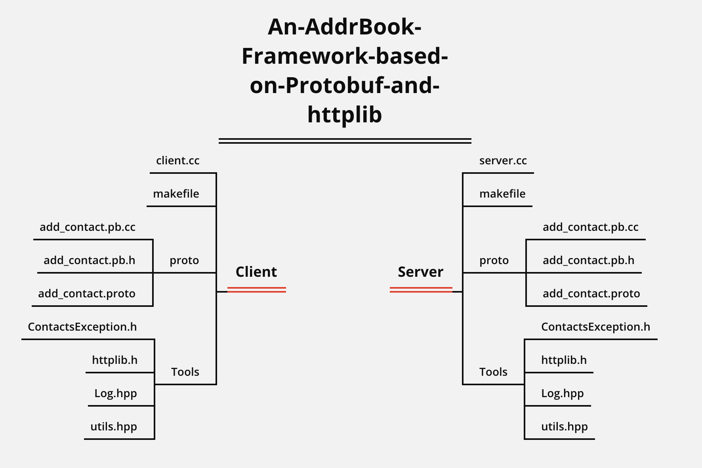

# An-AddrBook-Framework-based-on-Protobuf-and-httplib

An online address book project framework based on protobuf and httplib 

基于protobuf和httplib的在线通讯录项目框架。 

### 最新更新日期
2023年8月20日

## 项目需求

P将实现一个网络版本的通讯录，模拟实现客户端与服务端的交互，通过 Protobuf 来实现各端之间的协议序列化。

**需求如下：**

客户端可以选择对通讯录进行以下操作:

- 新增一个联系人

- 删除一个联系人

- 查询通讯录列表

- 查询一个联系人的详细信息

- 服务端提供增、删、查能力，并需要持久化通讯录。

- 客户端、服务端间的交互数据使用 Protobuf 来完成

**注意：鉴于作者只是利用本项目学习和使用P融通部分工具，因此，本Github仓库中只完成了项目框架，没有实现整个项目。后续作者会继续更新和完善此项目。**

完整项目可见另一位作者：https://gitee.com/hyb91/protobuf/tree/master/http_contacts_by_protobuf

本仓库完成内容：

- 搭建了客户端和服务端的基本框架
- 实现了使用protobuf新增联系人的功能，但暂时没有实现联系人功能的本地存储，只实现了服务端stdout的信息打印。
- 项目使用httplib库作为服务器。有兴趣的读者，可以下载我另一个仓库中的Reactor服务器作为底层来使用
- httplib地址：https://github.com/yhirose/cpp-httplib
- Reactor服务器地址：https://github.com/Yufccode/Reactor-based-HyperWebServer

## 项目运行

### 目录结构

### 升级GCC

如果使用 centOS 环境，yum源带的g++ 最新版本是4.8.5，发布于2015年，年代久远。编译该项目会出现异常。将 gcc/g++ 升级为更高版本可解决问题。

**升级参考：https://juejin.cn/post/6844903873111392263**

### Protobuf安装

**参考博客：http://t.csdn.cn/FMs7G**

### 运行项目

准备好环境之后就可以直接make Client和Server里面的makefile进行客户端和服务端的运行。
